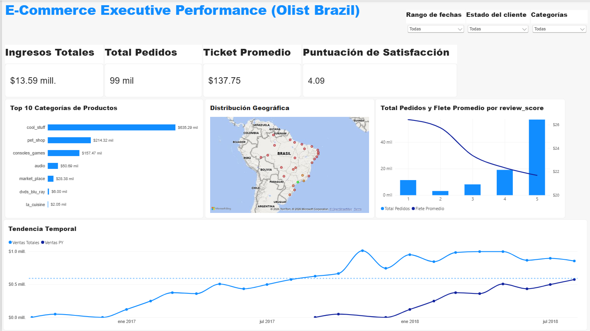

# 📊 E-Commerce Executive Performance Dashboard (Olist Brazil)


Un panel interactivo de nivel ejecutivo diseñado en Power BI para analizar el rendimiento comercial, la eficiencia logística y los factores de satisfacción del cliente en el dataset de **Olist Brasil**.

---

<p align="center">
  
</p>

---

## 🎯 Objetivo del Proyecto

Modelar y visualizar datos transaccionales de comercio electrónico para respaldar la toma de decisiones directivas, optimizando la integridad de las métricas (escalas monetarias, relaciones entre tablas y filtros temporales) bajo un diseño UX/UI limpio y profesional.

---

## 📈 Métricas Clave de Negocio (KPIs)

| KPI | Valor | Descripción |
| :--- | :--- | :--- |
| **Ingresos Totales** | **$13.59 Mill.** | Monto bruto acumulado en ventas de productos |
| **Total Pedidos** | **99 Mil** | Volumen total de órdenes procesadas |
| **Ticket Promedio** | **$137.75** | Valor monetario medio por orden de compra |
| **Puntuación de Satisfacción** | **4.09 / 5.00** | Calificación promedio global de los clientes (CSAT) |

---

## 💡 Hallazgos Principales (Executive Insights)

1. **Relación Flete vs. Calificación de Cliente:**
   * Existe un sesgo claro entre el costo del envío y la satisfacción: los pedidos con calificación de **1 estrella** registran un **Flete Promedio de ~$27**, mientras que las órdenes con **5 estrellas** promedian **~$21**.
2. **Concentración Geográfica:**
   * La mayor densidad de ventas e ingresos se focaliza en la región Sudeste de Brasil, liderada por los estados de **São Paulo (SP)**, **Río de Janeiro (RJ)** y **Minas Gerais (MG)**.
3. **Distribución del Volumen:**
   * El negocio demuestra una alta fidelización operativa: la inmensa mayoría de las órdenes procesadas (~57 mil) se concentran en puntuaciones de 5 estrellas.

---

## 🛠️ Soluciones Técnicas y Modelado

* **Formato Developer `.pbip`:** Estructuración del proyecto en formato *Power BI Project* para habilitar un control de versiones granular mediante Git y optimizar el almacenamiento en el repositorio.
* **Dirección de Filtro Cruzado (`Ambos`):** Corrección en el modelo dimensional entre `Fact_orders` y `Fact_order_reviews` para permitir que el contexto de filtro de `review_score` afecte a las métricas de flete y pedidos.
* **Geolocalización Directa (DAX):** Mapeo explícito mediante nombres completos de estado (`"Estado, Brasil"`) para garantizar la precisión de ubicación en Bing Maps.
* **Depuración Temporal:** Regla de filtrado visual en la serie de tiempo (`< 01/09/2018`) para suprimir registros residuales e incompletos del dataset.
* **Escalabilidad Monetaria:** Ajuste por factor de 100 en `price` y `freight_value` para normalizar los valores monetarios originales.

---

## 📁 Estructura del Repositorio

```text
.
├── assets/
│   └── dashboard_overview.png               # Captura en alta resolución del dashboard
├── dashboard/
│   ├── Olist_Executive_Performance.pbip    # Archivo principal de proyecto Power BI
│   ├── Olist_Executive_Performance.Report/  # Metadatos de diseño visual e informes
│   └── Olist_Executive_Performance.Dataset/ # Definición del modelo semántico y DAX
├── docs/
│   └── dax_measures_dictionary.md           # Diccionario técnico de medidas DAX
└── README.md                                # Documentación principal
```
---
git clone [https://github.com/noecastilloz/E-Commerce_Executive_Performance_Dashboard_-Olist-Brazil-.git](dashboard/Olist_Executive_Performance.pbit)
